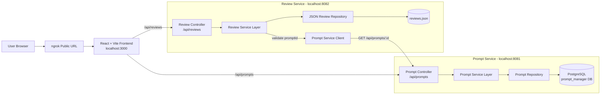

# Prompt Manager System

Prompt Manager System is a local microservices application for creating, managing, and reviewing AI prompts. It can be shared through one public ngrok link without Docker.

## Project Structure

```text
PromptManagerSystem/
+-- backend/
|   +-- api-gateway/       # Optional gateway, not needed for ngrok sharing
|   +-- prompt-service/    # Prompt CRUD API on port 8081
|   +-- review-service/    # Prompt review API on port 8082
+-- frontend/              # React + Vite UI on port 3000
+-- nginx/                 # Optional Docker reverse proxy config
+-- scripts/               # Local reset helpers
+-- .env                   # Local environment variables
+-- .env.example           # Example environment variables
+-- docker-compose.yml     # Optional Docker setup
```

## One-Link Ngrok Setup Without Docker

This setup exposes only the frontend through ngrok. The frontend uses Vite's local proxy to forward API calls:

```text
ngrok public URL -> Vite frontend on localhost:3000
/api/prompts    -> prompt-service on localhost:8081
/api/reviews    -> review-service on localhost:8082
```

Because the browser calls relative `/api/...` URLs, users only need the one ngrok link.


## Architecture Diagram



## Service Flow

- Users access one ngrok URL, which forwards traffic to the Vite frontend on `localhost:3000`.
- The frontend sends relative API requests so `/api/prompts` and `/api/reviews` stay under the same public link.
- Vite proxies prompt requests to the prompt service on `localhost:8081`.
- Vite proxies review requests to the review service on `localhost:8082`.
- The prompt service stores prompt data in PostgreSQL.
- The review service stores review data in `backend/review-service/reviews.json` and checks the prompt service before creating or updating reviews.

## Requirements

- Java 17+
- Maven 3.8+
- Node.js 18+
- PostgreSQL 13+
- ngrok account and ngrok CLI

## First-Time Setup

Create the PostgreSQL database:

```sql
CREATE DATABASE prompt_manager;
```

Install frontend dependencies:

```powershell
cd frontend
npm install
```

If ngrok is not configured yet, add your token once:

```powershell
ngrok config add-authtoken YOUR_NGROK_TOKEN
```

## Start The App Locally

Open three terminals from the project root.

Terminal 1, prompt service:

```powershell
cd backend/prompt-service
mvn spring-boot:run
```

Terminal 2, review service:

```powershell
cd backend/review-service
mvn spring-boot:run
```

Terminal 3, frontend:

```powershell
cd frontend
npm run dev
```

Check locally:

```text
http://localhost:3000
```

## Share With Ngrok

Open a fourth terminal and run:

```powershell
ngrok http 3000
```

ngrok will show a public forwarding URL like:

```text
https://your-url.ngrok-free.app
```

Share that one URL. Prompt creation, prompt updates, and reviews will work through the same link as long as the prompt service, review service, and frontend are still running locally.

## Ports

```text
Frontend:       http://localhost:3000
Prompt API:     http://localhost:8081/api/prompts
Review API:     http://localhost:8082/api/reviews
Ngrok command:  ngrok http 3000
```

## Reset Local Data

To start with no prompts or reviews:

```powershell
./scripts/reset-dev-data.ps1
```

This clears `backend/review-service/reviews.json` and truncates the local PostgreSQL `prompts` table.


